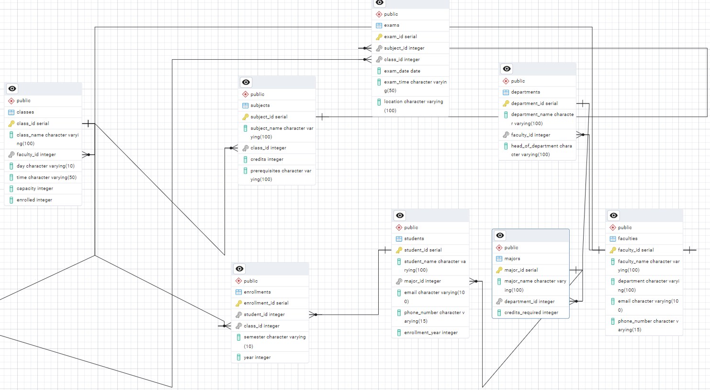

# University MultiTenant Application

This is spring boot 3 application uses hibernate multi tenant architecture with database level multi tenancy and postgres as database.
Small University Application with few entities and ERD as follows

![alt ERD for database] ()

## MultiTenant Architecture

- Class that implements MultiTenantConnectionProvider
- CurrentTenant Resolver
- To save and return current Tenant
- Fetch tenant id from header within filter and save to Thread
- While constructing EntityTransactionManager bean, multiTenantConnectionProvider, CurrentTenantResolver needs to be configured.

## Code
```
@Bean
    public LocalContainerEntityManagerFactoryBean entityManagerFactory(DataSource dataSource) {
        LocalContainerEntityManagerFactoryBean em = new LocalContainerEntityManagerFactoryBean();
        em.setDataSource(dataSource);
        em.setPackagesToScan("com.multitenant.demo.database.entities");
        em.setJpaVendorAdapter(new HibernateJpaVendorAdapter());
        Map<String, Object> properties = new HashMap<>();
        properties.put("hibernate.multiTenancy", "DATABASE");
        properties.put("hibernate.multi_tenant_connection_provider", dataSourceBasedMultiTenantConnectionProvider());
        properties.put("hibernate.tenant_identifier_resolver", new CurrentTenantIdentifierResolverImpl());
        properties.put("hibernate.dialect", "org.hibernate.dialect.PostgreSQLDialect");

        em.setJpaPropertyMap(properties);
        return em;
    }
```

Swagger is configured with application.

## Build and deploy
### Prequisites
- Install maven latest and Java 17 to your system.
- Postgres needs to installed in local system and create database called default.
- tenant_datasources table is where all tenants are stored, this table can be created within default database and add databases to your prefrences.
- tables can be created using createTables.sql file present in sourcecode.

Table can be created using following insert statement
```sh
CREATE TABLE tenant_datasources (
    tenant_datasource_id SERIAL PRIMARY KEY,
    tenant_identifier VARCHAR(100) UNIQUE,
    datasource_url VARCHAR(300),
    username VARCHAR(100),
    password VARCHAR(100),
    active BOOLEAN
);
```
Inserting tenant datasources into above table using following dml statements
```sh
insert into tenant_datasources (tenant_identifier,datasource_url, username, password, active) values
('universityA', 'jdbc:postgresql://localhost:5432/universityA', 'postgres', 'postgres', true);
insert into tenant_datasources (tenant_identifier,datasource_url, username, password, active) values
('universityB', 'jdbc:postgresql://localhost:5432/universityB', 'postgres', 'postgres', true);
```

### Build Sorce
To build source code use the below command
```sh
    mvn clean package -DskipTest
```

### Deploy
To deploy the application use the below command
```sh
    mvn spring-boot:run
```
Once deployed application can be accessible at localhost using post 8080.